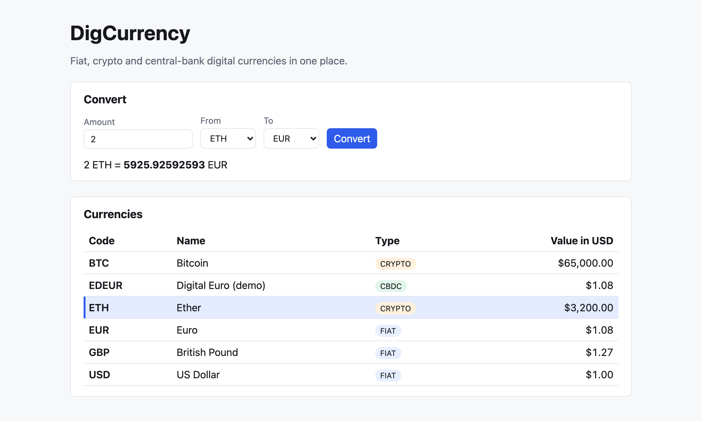

# DigCurrency


[](LICENSE)

A full-stack showcase app for managing currencies and converting between them. It has a **Spring Boot REST API** and a **React** single-page frontend.



DigCurrency handles three kinds of money side by side:

| Type | Meaning | Demo examples |
|---|---|---|
| `FIAT` | Government-issued currency | USD, EUR, GBP |
| `CRYPTO` | Cryptocurrency | BTC, ETH |
| `CBDC` | Central bank digital currency | EDEUR (Digital Euro, demo) |

Every currency has a rate in US dollars (`usdRate`). DigCurrency converts between any two currencies through USD.

## Features

- **Currency management:** list, filter by type, create, update and delete currencies through a versioned REST API (`/api/v1`).
- **Conversion:** convert an amount from any currency to any other. The API returns the exchange rate and the result.
- **Exact money math:** all amounts use `BigDecimal` with 8 decimal places and banker's rounding (`HALF_EVEN`). No floating-point errors.
- **Standard errors:** every error uses the [RFC 9457](https://www.rfc-editor.org/rfc/rfc9457) `ProblemDetail` JSON format.
- **Interactive API docs:** Swagger UI and an OpenAPI 3 spec are generated from the code.
- **Web UI:** a React page with a currency table and a converter form. Click a row in the table (or press Enter on it) to use that currency as the converter's "From" currency.

## Tech stack

| Layer | Technology |
|---|---|
| Backend | Java 21, Spring Boot 3.5, Spring Web, Spring Data JPA, Bean Validation, springdoc-openapi |
| Database | H2 in-memory (demo data is loaded at startup) |
| Frontend | React 19, TypeScript, Vite |
| Tests | JUnit 5, Mockito, Spring MockMvc, Vitest, Testing Library |

## Project structure

```
digcurrency/
├── backend/                  Spring Boot REST API (Maven)
│   └── src/main/java/com/digcurrency/
│       ├── currency/         Currency entity, repository, service, controller, DTOs
│       ├── conversion/       Conversion service and controller
│       ├── common/           Exceptions and global ProblemDetail handler
│       └── config/           OpenAPI and CORS configuration
├── frontend/                 React + TypeScript SPA (Vite)
│   └── src/
│       ├── api/              HTTP client and types that mirror the backend DTOs
│       └── components/       CurrencyTable, Converter
├── docs/images/              README screenshot
├── .github/workflows/        CI pipeline (GitHub Actions)
├── .claude/                  Claude Code skills and agents for development
└── CLAUDE.md                 Coding conventions for this repo
```

## Getting started

### Prerequisites

- **Java 21** (for example [Eclipse Temurin](https://adoptium.net/))
- **Maven 3.9+**
- **Node.js 20+** and npm

Check your setup:

```bash
java -version && mvn -v && node -v
```

### 1. Start the backend

```bash
cd backend
mvn spring-boot:run
```

The API runs at **http://localhost:8080**. At startup it loads six demo currencies into the in-memory database. All data is reset each time the backend restarts.

### 2. Start the frontend

In a second terminal:

```bash
cd frontend
npm install
npm run dev
```

Open **http://localhost:5173**. The Vite dev server forwards `/api` requests to the backend on port 8080, so start the backend first.

### Useful URLs

| URL | What it is |
|---|---|
| http://localhost:5173 | Web UI |
| http://localhost:8080/swagger-ui.html | Interactive API documentation |
| http://localhost:8080/v3/api-docs | OpenAPI 3 spec (JSON) |
| http://localhost:8080/actuator/health | Health check |
| http://localhost:8080/h2-console | H2 database console (JDBC URL `jdbc:h2:mem:digcurrency`, user `sa`, no password) |

## Using the API

### Endpoints

| Method | Path | Description | Success status |
|---|---|---|---|
| `GET` | `/api/v1/currencies` | List all currencies. Optional filter: `?type=FIAT\|CRYPTO\|CBDC` | `200` |
| `GET` | `/api/v1/currencies/{code}` | Get one currency | `200` |
| `POST` | `/api/v1/currencies` | Create a currency | `201` + `Location` header |
| `PUT` | `/api/v1/currencies/{code}` | Update a currency | `200` |
| `DELETE` | `/api/v1/currencies/{code}` | Delete a currency | `204` |
| `GET` | `/api/v1/conversions?from=&to=&amount=` | Convert an amount between two currencies | `200` |

### Examples

List all cryptocurrencies:

```bash
curl "http://localhost:8080/api/v1/currencies?type=CRYPTO"
```

Convert 0.5 BTC to EUR:

```bash
curl "http://localhost:8080/api/v1/conversions?from=BTC&to=EUR&amount=0.5"
```

```json
{"from":"BTC","to":"EUR","amount":0.5,"rate":60185.18518519,"result":30092.59259259}
```

Create a currency:

```bash
curl -X POST http://localhost:8080/api/v1/currencies \
  -H "Content-Type: application/json" \
  -d '{"code":"CHF","name":"Swiss Franc","type":"FIAT","usdRate":1.13}'
```

Request body fields for `POST` and `PUT`:

| Field | Rules |
|---|---|
| `code` | Required. 2–10 uppercase letters or digits, e.g. `CHF`. For `PUT`, it must match the code in the path. |
| `name` | Required. Up to 100 characters. |
| `type` | Required. `FIAT`, `CRYPTO` or `CBDC`. |
| `usdRate` | Required. Must be greater than 0. |

### Errors

Errors come back as `ProblemDetail` JSON:

```json
{
  "type": "about:blank",
  "title": "Resource not found",
  "status": 404,
  "detail": "Currency XXX not found",
  "instance": "/api/v1/currencies/XXX"
}
```

| Status | When |
|---|---|
| `400` | Invalid request body, negative conversion amount, or path/body code mismatch |
| `404` | The currency doesn't exist |
| `409` | A currency with that code already exists |

## Running the tests

```bash
# Backend: controller, service and end-to-end API tests
cd backend && mvn test

# Frontend: type check and unit/component tests
cd frontend && npm run typecheck && npm test
```

To create a production build of the frontend (output goes to `frontend/dist/`):

```bash
cd frontend && npm run build
```

### Continuous integration

GitHub Actions ([`.github/workflows/ci.yml`](.github/workflows/ci.yml)) runs on every push to `main` and on every pull request. It runs the backend tests, then the frontend type check, tests and production build.

## Development with Claude Code

This repo includes a [Claude Code](https://claude.com/claude-code) setup in `.claude/`. [`CLAUDE.md`](CLAUDE.md) describes the conventions it follows.

| Skill | Purpose |
|---|---|
| `add-endpoint` | Add a REST endpoint end to end: backend layers, tests, frontend client and types |
| `run-tests` | Run the backend and/or frontend test suites and report the results |
| `dev-server` | Start both dev servers and check that they're up |
| `api-check` | Smoke-test the running API and check that frontend types match the OpenAPI contract |

| Agent | Role |
|---|---|
| `backend-developer` | Spring Boot features and fixes |
| `frontend-developer` | React UI and API client work |
| `test-engineer` | Writes tests and diagnoses failures |
| `api-reviewer` | Read-only review of API design and the contract between backend and frontend |

## License

This project is licensed under the [MIT License](LICENSE).
